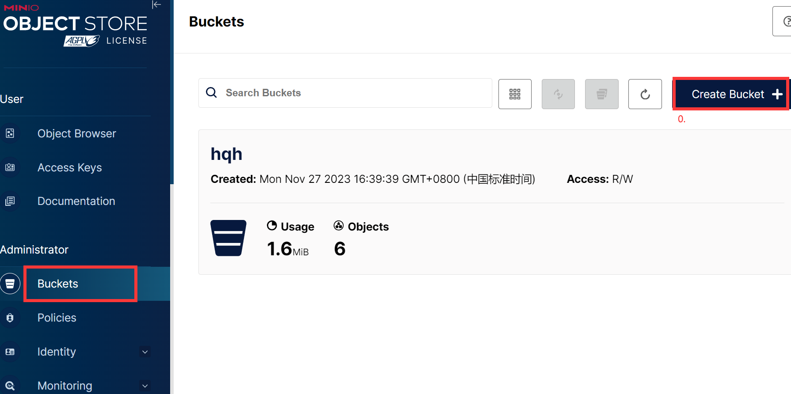
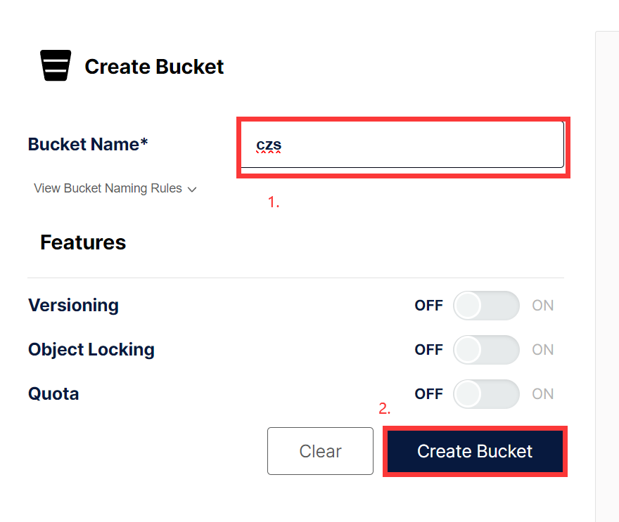
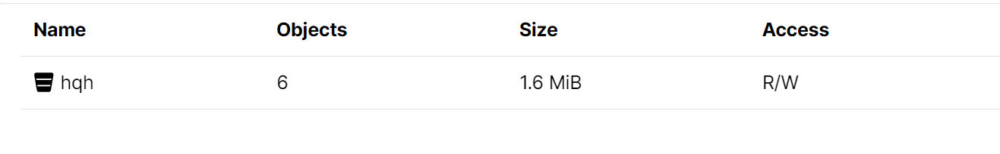

# 后端

##  MInIO操作手册

### 1. 创建bucket

> 0. Administrator>bucket中创建bucket
>
> 1. 输入bucket_name
> 2. 创建成功在user>Object Browser中可以看到桶的名字

### 2. 上传训练图像（TI）

> 1. 在桶中建立训练图像文件夹（ti）
> 2. 上传文件夹

### 3. 上传参考图像文件夹（）

